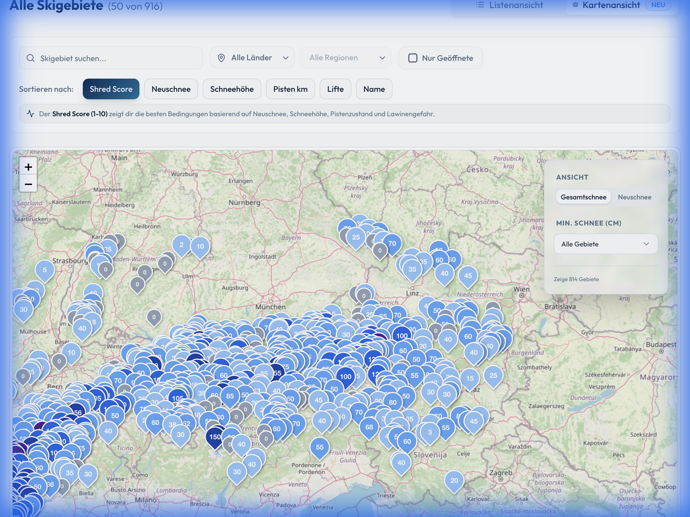

# Bergfex Snow Dashboard 🏂

[](http://bergfex-dashboard.onrender.com/)

> [!NOTE]
> Die App ist live auf **Render** (Free Tier) gehostet. Bitte beachte, dass der erste Aufruf bis zu 30-60 Sekunden dauern kann, da der Server bei Inaktivität in den Ruhezustand geht ("Cold Start").


## Management Summary
Das **Bergfex Snow Dashboard** ist eine leistungsstarke Full-Stack-Webanwendung zur Echtzeit-Analyse und Visualisierung von Skigebietsdaten im gesamten Alpenraum. Es aggregiert Daten von über 700 Skigebieten und bietet Wintersport-Enthusiasten sowie Analysten eine intuitive Plattform, um die besten Bedingungen ("Shred Conditions") auf einen Blick zu identifizieren. 

Das Herzstück der Anwendung ist der eigens entwickelte **Shred Score**, der über einfache Schneehöhen hinausgeht und eine qualitative Bewertung des Pistentages liefert.

### 🔗 [Direkt zur Live-Anwendung](http://bergfex-dashboard.onrender.com/)

---

## Key Features 🚀

### 1. Der Shred Score 📈
Ein dynamischer Algorithmus zur Bewertung der aktuellen Bedingungen. Im Gegensatz zu einfachen Filtern berechnet dieser Score die Attraktivität eines Skigebiets basierend auf:
- **Neuschnee & Schneehöhe**: Quantität der Unterlage.
- **Fahrbare Pistenlängen**: Verhältnis von offenen zu gesamten Pistenkilometern.
- **Pistenqualität**: Aktueller Zustand der Abfahrten.
- **Lawinengefahr**: Sicherheitsfaktoren fließen negativ in den Score ein, um ein realistisches Lagebild zu zeichnen.

### 2. Interaktive Kartenansicht 🗺️
Eine filterbare Karte ermöglicht die räumliche Analyse der Schneebedingungen. 
- **Echtzeit-Filter**: Umschalten zwischen Schneehöhen (Berg/Tal) und Neuschnee.
- **Geovisualisierung**: Marker-Clustering und farbkodierte Overlays zur schnellen Orientierung.



### 3. Historische Daten & Trends 📊
Analyse der Schneehöhen-Entwicklung über die Zeit, um Trends für die Saisonplanung abzuleiten.

---

## Technologie Stack 💻

### Frontend
- **Framework**: React 18 mit Vite
- **Sprache**: TypeScript (für hohe Typsicherheit und Wartbarkeit)
- **Styling**: Tailwind CSS & shadcn/ui für ein modernes, responsives UI/UX
- **Karten**: Leaflet.js / React-Leaflet
- **Charts**: Recharts

### Backend & Infrastructure
- **API**: FastAPI (Python 3.10+)
- **Data Warehouse**: Google BigQuery
- **Datenbeschaffung**: Automatisierter Scraper (Bergfex ETL-Pipeline)
- **Provisionierung**: Terraform (Infrastructure as Code)
- **Containerisierung**: Docker

---

## Installation & Setup 🛠️

```sh
# Repository klonen
git clone <YOUR_GIT_URL>
cd bergfex-dashboard

# Abhängigkeiten installieren
npm install

# Development Server starten (Client & Backend Proxy)
npm run dev
```

---
*Entwickelt als Showcase für moderne Web-Architekturen, Geo-Daten-Visualisierung und effiziente Datenverarbeitung.*

**Hier geht's zur Live-Anwendung:** [SnowRadar Dashboard](http://bergfex-dashboard.onrender.com/)
