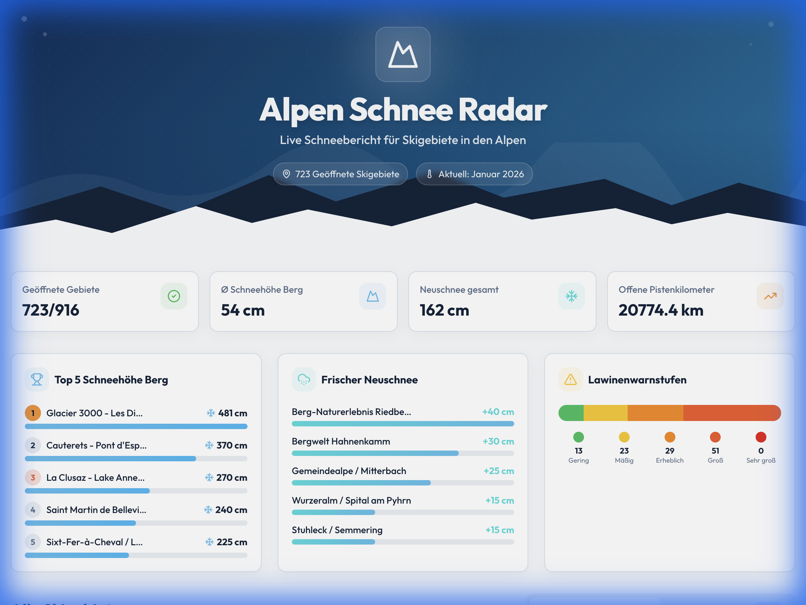

# Bergfex Snow Dashboard 🏂

[](http://bergfex-dashboard.onrender.com/)

> [!NOTE]
> Die App ist live auf **Render** (Free Tier) gehostet. Bitte beachte, dass der erste Aufruf bis zu 30-60 Sekunden dauern kann, da der Server bei Inaktivität in den Ruhezustand geht ("Cold Start").



## Management Summary
Das **Bergfex Snow Dashboard** ist eine Full-Stack-Webanwendung zur Echtzeit-Analyse und Visualisierung von Skigebietsdaten. Es aggregiert Daten von über 700 Skigebieten und bietet Wintersport-Enthusiasten sowie Analysten eine intuitive Plattform, um die besten Bedingungen auf einen Blick mit Hilfe des eigens entwickelten "Shred Score" zu identifizieren oder die Schneehöhen und Neuschnee der Gebiete auf einer intuitiven Weltkarte zu visualisieren. 


### 🔗 [Direkt zur Live-Anwendung](http://bergfex-dashboard.onrender.com/)

---

## Key Features 🚀

### 1. Der Shred Score 📈
Ein dynamischer Algorithmus zur Bewertung der aktuellen Bedingungen. Im Gegensatz zu einfachen Filtern berechnet dieser Score die Attraktivität eines Skigebiets basierend auf:
- **Neuschnee & Schneehöhe**: Quantität der Unterlage.
- **Fahrbare Pistenlängen**: Verhältnis von offenen zu gesamten Pistenkilometern.
- **Pistenqualität**: Aktueller Zustand der Abfahrten.
- **Lawinengefahr**: Sicherheitsfaktoren fließen negativ in den Score ein, um ein realistisches Lagebild zu zeichnen.

### 2. Interaktive Kartenansicht 🗺️
Eine filterbare Karte ermöglicht die räumliche Analyse der Schneebedingungen. 
- **Filterbar & Intuitiv**: Umschalten zwischen Schneehöhen (Berg/Tal) und Neuschnee.
- **Geovisualisierung**: Marker-Clustering und farbkodierte Overlays zur schnellen Orientierung.


### 3. Historische Daten & Trends 📊
Analyse der Schneehöhen-Entwicklung über die Zeit, um Trends abzuleiten.


---

## Technologie Stack 💻

### Frontend
- **Framework**: React 18 mit Vite
- **Sprache**: TypeScript
- **Styling**: Tailwind CSS & shadcn/ui
- **Karten**: Leaflet.js / React-Leaflet
- **Charts**: Recharts

### Backend & Infrastructure
- **API**: FastAPI (Python 3.10+)
- **Data Warehouse**: Google BigQuery
- **Datenbeschaffung**: Automatisierter Scraper mit CI/CD & automatisierten Tests (Bergfex ETL-Pipeline, siehe [bergfex-scraper](https://github.com/bergfex/bergfex-scraper))
- **Provisionierung**: Terraform (Infrastructure as Code)
- **Containerisierung**: Docker

*KI-assistierte Entwicklung mit Google Antigravity, manuell reviewt per Pull Requests und optimiert.*

---

## Installation & Setup 🛠️

```sh
# Repository klonen
git clone <YOUR_GIT_URL>
cd bergfex-dashboard

# Abhängigkeiten installieren
npm install

# Development Server starten (Client & Backend Proxy)
npm run dev
```

---

**Hier geht's zur Live-Anwendung:** [SnowRadar Dashboard](http://bergfex-dashboard.onrender.com/)
