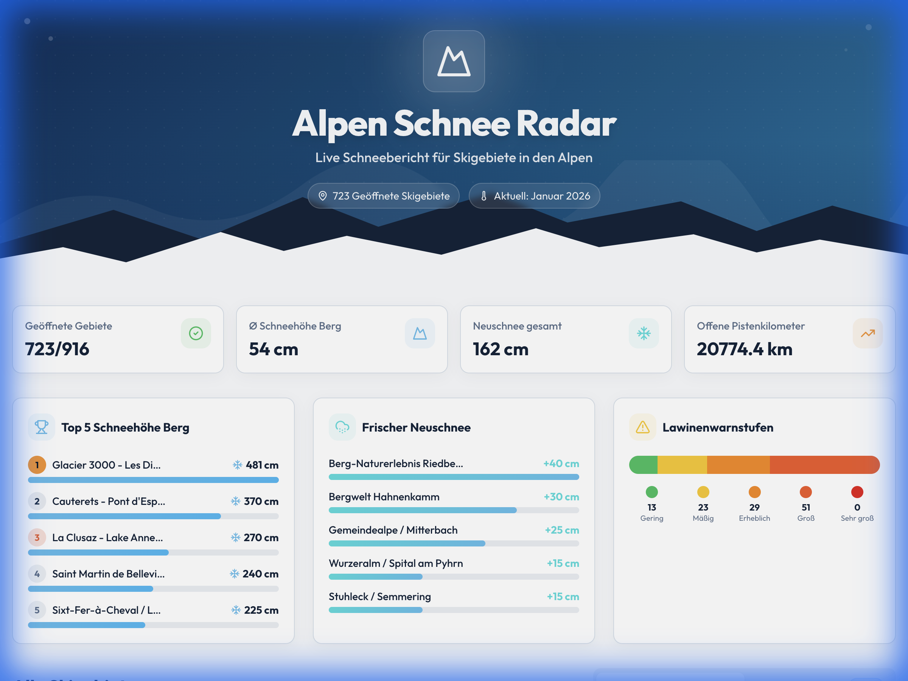
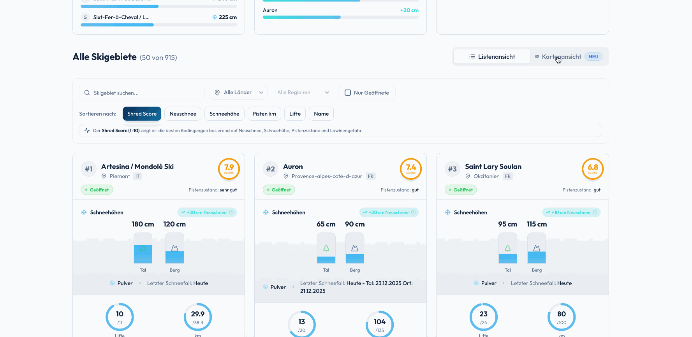
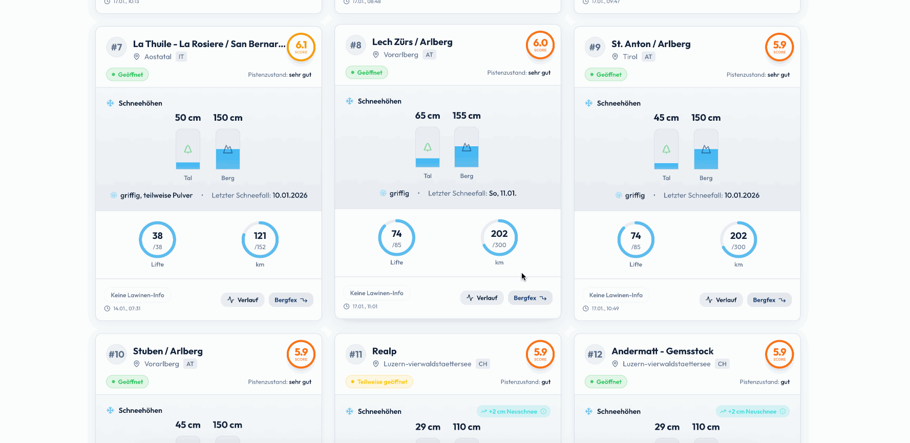

# Bergfex Snow Dashboard 🏂

[](http://bergfex-dashboard.onrender.com/)

> [!NOTE]
> Die App ist live auf **Render** (Free Tier) gehostet. Bitte beachte, dass der erste Aufruf bis zu 30-60 Sekunden dauern kann, da der Server bei Inaktivität in den Ruhezustand geht ("Cold Start").



## Management Summary
Das **Bergfex Snow Dashboard** ist eine Full-Stack-Webanwendung zur Echtzeit-Analyse und Visualisierung von Skigebietsdaten. Es aggregiert Daten von über 700 Skigebieten und bietet Wintersport-Enthusiasten sowie Analysten eine intuitive Plattform, um die besten Bedingungen auf einen Blick mit Hilfe des eigens entwickelten "Shred Score" zu identifizieren oder die Schneehöhen und Neuschnee der Gebiete auf einer intuitiven Weltkarte zu visualisieren. 


### 🔗 [Direkt zur Live-Anwendung](http://bergfex-dashboard.onrender.com/)

---

## Key Features 🚀

### 1. Der Shred Score 📈
Ein dynamischer Algorithmus zur Bewertung der aktuellen Bedingungen. Im Gegensatz zu einfachen Filtern berechnet dieser Score die Attraktivität eines Skigebiets basierend auf:
- **Neuschnee & Schneehöhe**: Quantität der Unterlage.
- **Fahrbare Pistenlängen**: Verhältnis von offenen zu gesamten Pistenkilometern.
- **Pistenqualität**: Aktueller Zustand der Abfahrten.
- **Lawinengefahr**: Sicherheitsfaktoren fließen negativ in den Score ein, um ein realistisches Lagebild zu zeichnen.

### 2. Interaktive Kartenansicht 🗺️
Eine filterbare Karte ermöglicht die räumliche Analyse der Schneebedingungen. 
- **Filterbar & Intuitiv**: Umschalten zwischen Schneehöhen (Berg/Tal) und Neuschnee.
- **Geovisualisierung**: Marker-Clustering und farbkodierte Overlays zur schnellen Orientierung.



### 3. Historische Daten & Trends 📊
Analyse der Schneehöhen-Entwicklung über die Zeit, um Trends abzuleiten.



### 4. Agentische Skigebiets-Suche 🤖
Der Chat ist als echter LangGraph-Workflow umgesetzt. Gemini entscheidet anhand
der Frage, welche typisierten LangChain-Tools aufgerufen werden:

- **BigQuery Resortsuche**: kontrollierte, parametrisierte Abfrage für Schnee,
  Öffnungsstatus, Lawinenwarnstufe und den bestehenden Shred Score.
- **Wetterprognose**: DWD-Wetter via Open-Meteo mit MET Norway als öffentlichem
  Fallback.
- **Fahrtzeit**: ungefähre Autorouten via openrouteservice und OpenStreetMap;
  dafür ist ein kostenloser API-Key erforderlich.
- **SLF-Lawinenbulletin**: offizielles Schweizer CAAML/GeoJSON-Bulletin per
  Punkt-in-Polygon-Zuordnung.
- **Gesprächskontext**: LangGraph hält den Verlauf pro Browser-Thread im Speicher
  des laufenden Backend-Prozesses.

---

## Technologie Stack 💻

### Frontend
- **Framework**: React 18 mit Vite
- **Sprache**: TypeScript
- **Styling**: Tailwind CSS & shadcn/ui
- **Karten**: Leaflet.js / React-Leaflet
- **Charts**: Recharts

### Backend & Infrastructure
- **API**: FastAPI (Python 3.11+)
- **Agent**: LangChain + LangGraph + Gemini
- **Data Warehouse**: Google BigQuery
- **Datenbeschaffung**: Automatisierter Scraper mit CI/CD & automatisierten Tests (Bergfex ETL-Pipeline, siehe [bergfex-scraper](https://github.com/bergfex/bergfex-scraper))
- **Provisionierung**: Terraform (Infrastructure as Code)
- **Containerisierung**: Docker

*KI-assistierte Entwicklung mit Google Antigravity, manuell reviewt per Pull Requests und optimiert.*

---

## Installation & Setup 🛠️

```sh
# Repository klonen & in Ordner wechseln
cd bergfex-dashboard

# Lokalen Dev-Server starten (installiert automatisch Abhängigkeiten)
./start-dev.sh
```

Weitere Details zum lokalen Setup und der Architektur findest du in [LOCAL_DEVELOPMENT.md](LOCAL_DEVELOPMENT.md).

## Render-Konfiguration

Lege diese Werte im Render-Dashboard unter **Environment** an. Secrets nicht in
Git committen.

| Variable | Pflicht | Inhalt |
| :--- | :---: | :--- |
| `GEMINI_API_KEY` | Ja, für den Agenten | API-Key aus Google AI Studio |
| `GOOGLE_CREDENTIALS_JSON` | Ja, für BigQuery | Vollständiges Service-Account-JSON als einzeiliger Secret-Wert |
| `GCP_PROJECT_ID` | Empfohlen | Standard: `bergfex-481612` |
| `BQ_DATASET_ID` | Optional | Standard: `bergfex_data` |
| `BQ_VIEW_ID` | Optional | Standard: `vw_latest_snow_with_shred_score` |
| `GEMINI_MODEL` | Optional | Standard: `gemini-3.5-flash-lite` |
| `OPEN_METEO_API_KEY` | Optional | Customer-Key für dedizierte Open-Meteo-Kapazität; ohne Key wird die gedrosselte freie API verwendet |
| `WEATHER_USER_AGENT` | Optional | Identifikation für den MET-Norway-Fallback; Standard verweist auf die Render-App |
| `OPENROUTESERVICE_API_KEY` | Optional | API-Key für Fahrtzeit- und Entfernungsschätzungen; kostenlos im openrouteservice-Dashboard erhältlich |
| `FRONTEND_URL` | Empfohlen | Öffentliche Render-URL, z. B. `https://bergfex-dashboard.onrender.com` |
| `ENVIRONMENT` | Ja in Produktion | `production` aktiviert das Agenten-Rate-Limit |

`PORT` wird von Render automatisch gesetzt. Bei einem Open-Meteo-Fehler nutzt
der Agent MET Norway als reduzierte Wetterquelle. Open-Meteo Free, MET Norway
und das öffentliche SLF-Bulletin benötigen keinen API-Key.

---

**Hier geht's zur Live-Anwendung:** [SnowRadar Dashboard](http://bergfex-dashboard.onrender.com/)
